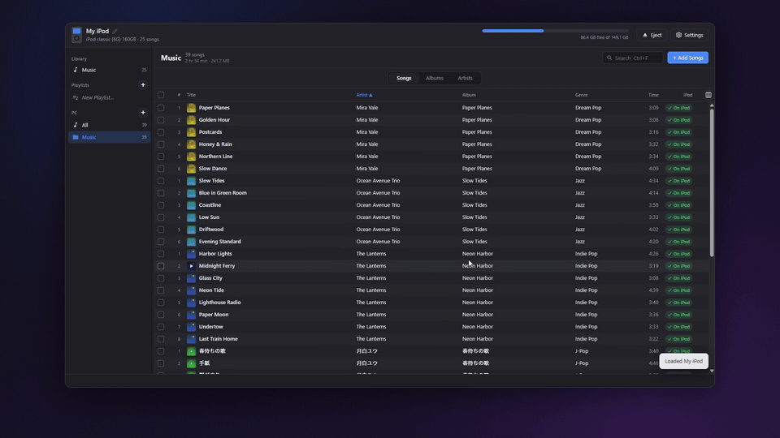
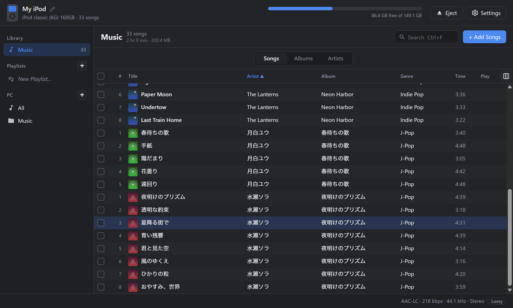
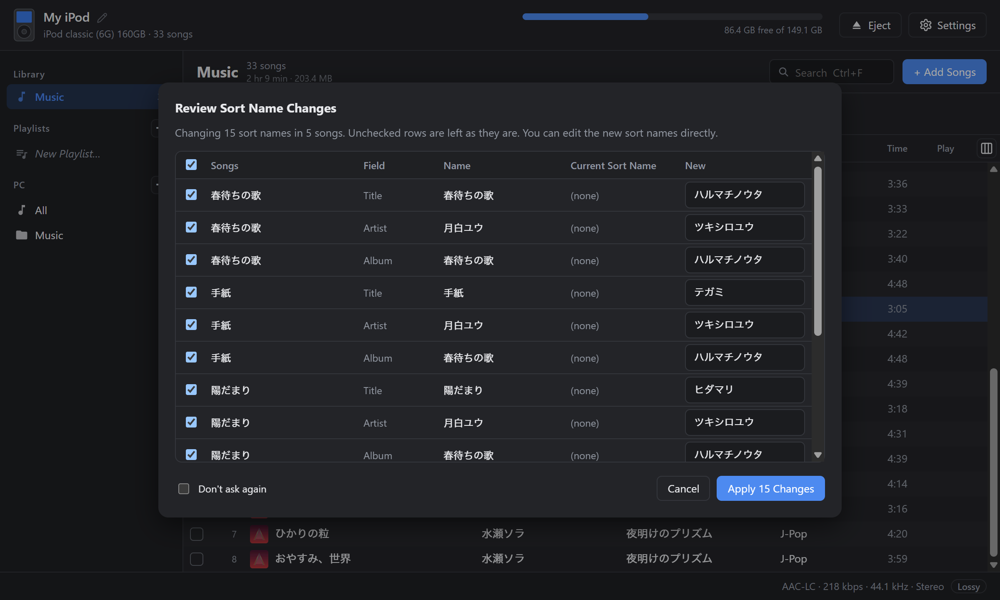
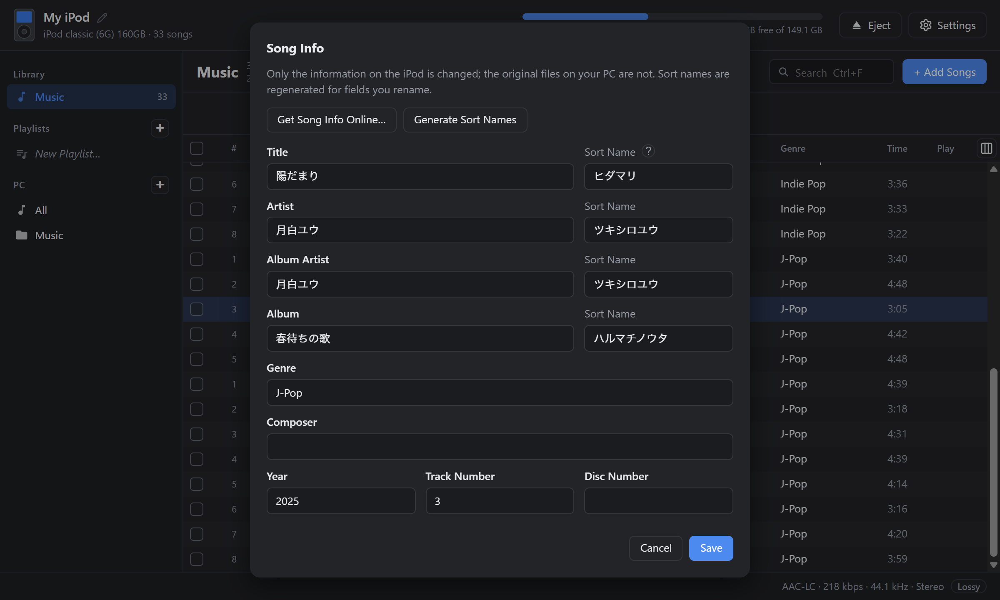
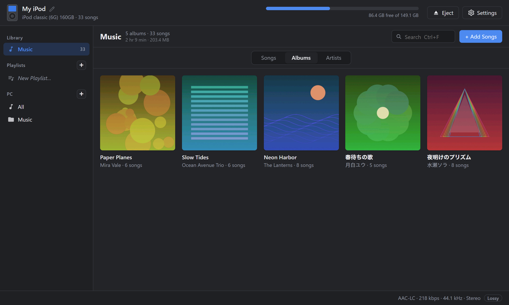

# iPod Sync

**Drag and drop music onto your iPod classic. No iTunes needed.**

A desktop app for Windows and macOS

[**Download**](https://github.com/ishiichan-dayo/iPod-Sync-releases/releases/latest) · [日本語](README.md)

[Watch the full demo (54 s, with sound)](https://github.com/ishiichan-dayo/iPod-Sync-releases/releases/download/v0.6.0/ipod-sync-demo.mp4)

---

## Features

- **Just drop to transfer**: drop songs or album folders onto the window. Drop onto a playlist to add them there too
- **Any format**: MP3 / AAC / ALAC / WAV / AIFF go over as-is. FLAC / Ogg / Opus / WMA and others are converted automatically (lossless → ALAC, lossy → AAC 256 kbps)
- **Artwork included**: uses embedded images, or `cover.jpg` / `folder.jpg` in the same folder. Missing covers can be searched online (iTunes / Deezer / MusicBrainz)
- **Browse and tidy your iPod**: switch between Songs / Albums / Artists, play songs, edit song info, create and reorder playlists, copy songs back to your PC
- **Your PC music folders in the same window**: songs already on the iPod are marked, so you can send just the missing ones
- **Automatic updates**: the app tells you when a new version is out and updates in one click

## Japanese titles sorted correctly

The iPod sorts by "sort names". Japanese songs without them end up lumped together at the end of the list on the device.

iPod Sync adds Japanese readings as sort names when transferring (e.g. 椎名林檎 → シイナリンゴ), using a built-in dictionary (IPADIC) — no internet needed.

- Songs already on the iPod (e.g. added with iTunes) can be given sort names in one go
- Review every change (name / current sort name / new) before applying. Uncheck rows or edit the readings as you like
- Readings of personal names can be wrong. Fix them any time in Song Info

## Album view

## Supported iPods

| Model | Support |
| --- | --- |
| iPod classic 6G / 6.5G / 7G (80 / 120 / 160 GB) | Yes |
| iPod video 5G / 5.5G | Yes |
| iPod nano 3G / 4G | Yes |
| iPod photo, iPod nano 1G / 2G | Yes |
| iPod 1G–4G (monochrome), iPod mini 1G / 2G | Yes (music only — the screen can't show artwork) |
| iPod nano 5G and later, iPod touch | No (read-only) |
| iPod shuffle | No |

- iPods modded with iFlash or other SD adapters work just like stock ones
- **On Windows, the iPod must be Windows-formatted (FAT32).** Mac-formatted (HFS+) iPods can't be read by Windows — restore it in iTunes to reformat it for Windows. On macOS, both formats work
- iPod 1G / 2G connect over FireWire only, so you'll need an adapter for modern PCs

## Download

Get the file for your OS from the [latest release](https://github.com/ishiichan-dayo/iPod-Sync-releases/releases/latest).

| OS | File |
| --- | --- |
| Windows 10 / 11 (64-bit) | `iPod.Sync_x.y.z_x64-setup.exe` |
| macOS (Intel / Apple Silicon) | `iPod.Sync_x.y.z_universal.dmg` |

Once installed, the app lets you know when a new version is available.

### First launch

The app isn't code-signed yet, so you'll see a warning the first time.

- **Windows**: if you see "Windows protected your PC", click "More info" → "Run anyway"
- **macOS**: right-click the app in Finder → "Open"

### About ffmpeg

Converting FLAC and other formats requires ffmpeg (not needed for MP3 / AAC / ALAC / WAV / AIFF).

- **Windows**: install it in one click from the app's Settings
- **macOS**: `brew install ffmpeg`

## How to use

1. Connect your iPod over USB and start the app. It finds the iPod automatically
2. Drag and drop songs or album folders onto the window
3. When you're done, click "Eject" before unplugging

Right-click for delete, export, add to playlist, edit song info and sort names, and set artwork.

## Safety

- The first time an iPod is opened, its original database is saved as `iPod_Control/iTunes/iTunesDB.ipodsync-backup`. If anything goes wrong, copy it back to `iTunesDB` to restore
- The database is written to a temporary file first and then swapped in, so an interrupted write is unlikely to corrupt it
- If iTunes / Music.app is set to sync automatically, it may remove songs added with this app. Set it to "Manually manage music"
- The app only goes online for artwork / song info searches, installing ffmpeg, and checking for updates (searches send the artist and album name to each service)

## Limitations

- Podcast grouping and editing smart playlists aren't supported (existing smart playlists are kept as they are)
- Videos can't be transferred

## Bug reports and requests

Please use [Issues](https://github.com/ishiichan-dayo/iPod-Sync-releases/issues). Including your iPod model (shown at the top left of the window) and OS helps a lot.

## Support

iPod Sync is a free app made by one person. If you find it useful, you can [buy me a coffee on Ko-fi](https://ko-fi.com/ishiichan_dayo). It helps keep development going.

---

iPod and iTunes are trademarks of Apple Inc. This software is not affiliated with Apple.
