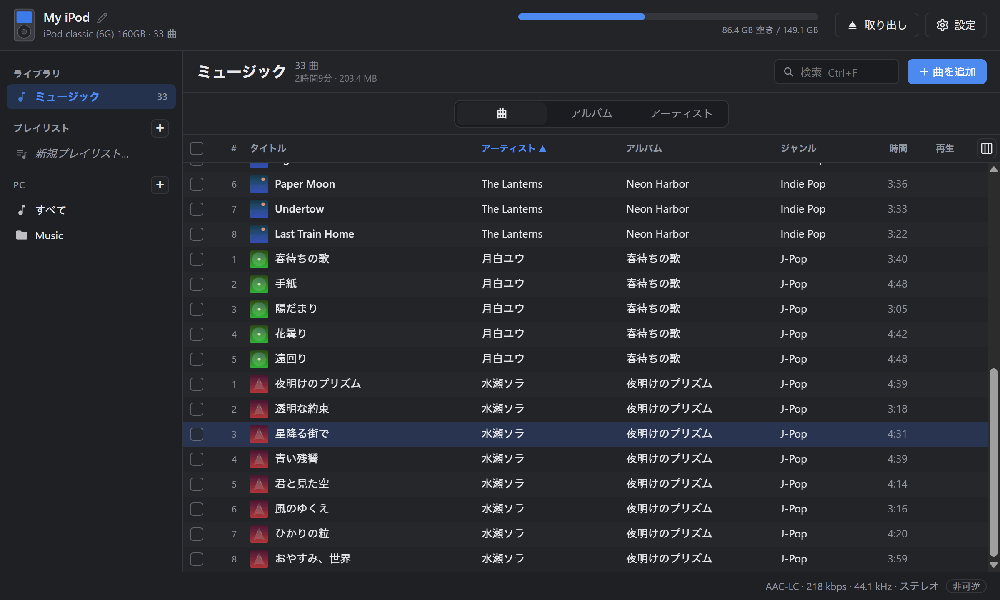
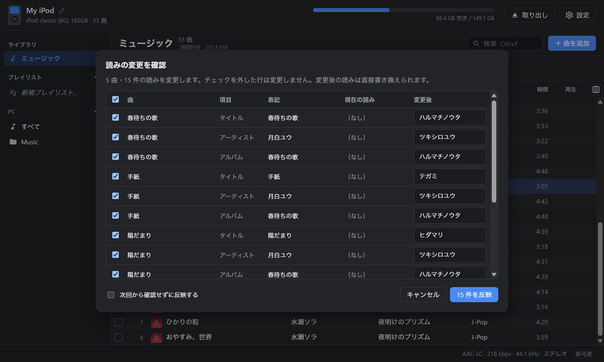
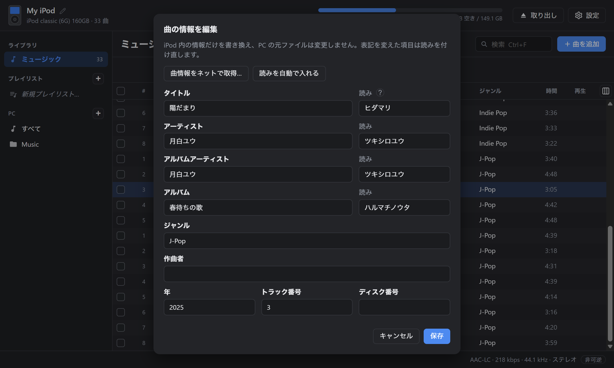
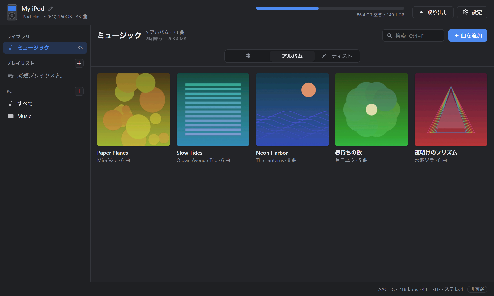

# iPod Sync

**iPod classic に、ドラッグ＆ドロップで曲を入れる。iTunes はいりません。**

Windows / macOS 用のデスクトップアプリ

[**ダウンロード**](https://github.com/ishiichan-dayo/iPod-Sync-releases/releases/latest) ・ [English](README.en.md)

[紹介動画（54 秒・音あり）](https://github.com/ishiichan-dayo/iPod-Sync-releases/releases/download/v0.6.0/ipod-sync-demo.mp4)

---

## できること

- **ドロップするだけで転送**：曲やアルバムのフォルダをウィンドウに落とすだけ。プレイリストの上に落とせば、そのプレイリストにも入ります
- **どんな形式でも入る**：MP3 / AAC / ALAC / WAV / AIFF はそのまま。FLAC / Ogg / Opus / WMA などは自動で変換します（可逆 → ALAC、非可逆 → AAC 256kbps）
- **アートワークも一緒に**：曲に埋め込まれた画像、なければ同じフォルダの `cover.jpg` などを使います。見つからないときはネットで探して選べます（iTunes / Deezer / MusicBrainz）
- **iPod の中身を見る・整える**：曲 / アルバム / アーティストの表示切り替え、再生、曲情報の編集、プレイリストの作成と並び替え、PC への書き出し
- **PC の音楽フォルダも同じ画面で**：iPod に入れ済みの曲には印が付くので、足りない曲だけ選んで送れます
- **自動アップデート**：新しい版が出ると起動時にお知らせ。ワンクリックで更新できます

## 日本語の曲が、iPod でちゃんと並ぶ

iPod は曲名やアーティスト名の「読み」で並べ替えます。読みが無い日本語の曲は、本体の一覧で後ろにまとめて押しやられてしまいます。

iPod Sync は転送するときに読みを自動で付けます（「椎名林檎」→「シイナリンゴ」）。辞書（IPADIC）を内蔵しているので、ネットにはつながりません。

- iTunes で入れた曲など、すでに iPod にある曲にもまとめて読みを付けられます
- 付ける前に「元の表記・今の読み・変更後」を一覧で確認できます。行ごとに外したり、読みを書き換えたりもできます
- 人名などで読みを誤ることがあります（例：米津玄師 → ヨネツゲンシ）。曲情報の編集画面でいつでも直せます

## アルバム表示

## 対応機種

| 機種 | 対応 |
| --- | --- |
| iPod classic 6G / 6.5G / 7G（80・120・160GB） | ○ |
| iPod video 5G / 5.5G | ○ |
| iPod nano 3G / 4G | ○ |
| iPod photo・iPod nano 1G / 2G | ○ |
| iPod 1G〜4G（白黒液晶）・iPod mini 1G / 2G | ○（画面がアートワーク非対応のため曲のみ） |
| iPod nano 5G 以降・iPod touch | ×（読み取りのみ） |
| iPod shuffle | × |

- iFlash などで SD カードに換装した iPod も、普通の iPod と同じように使えます
- **Windows では Windows 形式（FAT32）の iPod が必要です。** Mac 形式（HFS+）の iPod は Windows から読めないため、iTunes で「復元」して Windows 形式に初期化してください。macOS ではどちらの形式でも使えます
- iPod 1G / 2G は FireWire 接続のため、今の PC につなぐには別の機器が必要です

## ダウンロード

[最新版のリリース](https://github.com/ishiichan-dayo/iPod-Sync-releases/releases/latest) から、お使いの OS 用のファイルをダウンロードしてください。

| OS | ファイル |
| --- | --- |
| Windows 10 / 11（64 bit） | `iPod.Sync_x.y.z_x64-setup.exe` |
| macOS（Intel / Apple Silicon） | `iPod.Sync_x.y.z_universal.dmg` |

一度インストールすれば、以降はアプリが新しいバージョンを知らせてくれます。

### 初回起動時の注意

アプリにはまだコード署名をしていないため、初回だけ警告が出ます。

- **Windows**：「Windows によって PC が保護されました」と表示されたら「詳細情報」→「実行」
- **macOS**：Finder でアプリを右クリック →「開く」

### ffmpeg について

FLAC などを変換して転送するには ffmpeg が必要です（MP3 / AAC / ALAC / WAV / AIFF だけなら不要）。

- **Windows**：アプリの設定画面からワンクリックで入れられます
- **macOS**：`brew install ffmpeg`

## 使い方

1. iPod を USB でつないでアプリを起動します。iPod は自動で見つかります
2. 曲・アルバムのフォルダをウィンドウにドラッグ＆ドロップします
3. 終わったら「取り出し」を押してからケーブルを抜きます

右クリックメニューから、削除・書き出し・プレイリストへの追加・曲情報や読みの編集・アートワークの設定ができます。

## 安心して使うために

- 初めて開いた iPod の元のデータベースを `iPod_Control/iTunes/iTunesDB.ipodsync-backup` に残します。困ったときはこれを `iTunesDB` に戻せば元どおりです
- データベースは一時ファイルに書いてから置き換えるので、書き込みの途中で止まっても壊れにくくしています
- iTunes / ミュージック.app の「自動同期」が有効だと、このアプリで入れた曲が消されることがあります。iTunes 側は「手動で管理」にしてください
- ネットに接続するのは、アートワーク・曲情報のネット検索、ffmpeg の導入、更新の確認のときだけです（検索ではアーティスト名・アルバム名を各サービスに送ります）

## 制限事項

- ポッドキャストのグループ表示、スマートプレイリストの編集には対応していません（既存のスマートプレイリストはそのまま残ります）
- 動画は転送できません

## 不具合の報告・要望

[Issues](https://github.com/ishiichan-dayo/iPod-Sync-releases/issues) にお寄せください。iPod の機種（画面の左上に表示されます）と OS を書いていただけると助かります。

## 応援

iPod Sync は個人で開発している無料のアプリです。気に入っていただけたら、[Ko-fi](https://ko-fi.com/ishiichan_dayo) で応援していただけるとうれしいです。開発を続ける励みになります。

---

iPod・iTunes は Apple Inc. の商標です。このソフトウェアは Apple とは関係ありません。
